# Ejemplos de Clase – Programación Orientada a Objetos en Python

En esta sección se replican los ejemplos básicos vistos en clase sobre POO en Python y Encapsulación incluyendo:

+ Clase Y Constructor
+ Atributos
+ Métodos
+ Encapsulación

Cada archivo contiene unos ejemplos simples y funcionales de la documentación, son ejecutables desde consola.

## 📁 Estructura 

```python
ejemplos_clase/
├── clase_y_constructor.py
├── metodos.py
├── atributos.py
└── encapsulacion.py
```

## Ejecutar

Desde la terminal, ubícate en la carpeta del proyecto y ejecuta:

### Clase Y Constructor
```python
python ejemplos_clase/clase_y_constructor.py
```

### Atributos
```python
python ejemplos_clase/atributos.py
```

### Métodos
```python
python ejemplos_clase/metodos.py
```

### Encapsulación
```python
python ejemplos_clase/encapsulacion.py
```

# Evidencias de Funcionamiento

## Clase y Constructor

<details>
<summary>Ver capturas de Clase y Constructor</summary>

---

## El método constructor: __init__

Mostrar:

- Creación de `ana`
- Creación de `juan`
- Impresión de atributos


---

## PARÁMETRO SELF


## Valores predeterminados en el constructor

Mostrar:

- Producto con stock por defecto
- Producto con stock personalizado


---

## Inicialización de atributos con cálculos

Mostrar:

- Resultado del área
- Resultado del perímetro


---

## Atributos con validación

Mostrar:

- Cuenta válida
- Error ValueError


---

## Ejemplo práctico: Modelando una biblioteca

Mostrar:

- Estado disponible
- Estado prestado


---

## Constructores alternativos con métodos de clase

Mostrar:

- Fecha normal
- Fecha desde texto
- Fecha actual


---

</details>

---

## Atributos

<details>
<summary>Ver capturas de atributos</summary>

---

# Atributos de Instancia

Mostrar:

- Creación de `e1`
- Creación de `e2`
- Impresión de nombres


# Atributos de clase

Mostrar:

- Valor inicial de nombre_uni
- Cambio de atributo de clase
- Nuevo valor reflejado en ambos objetos


# Acceso de Atributos

Mostrar:

- Color inicial
- Cambio de color
- Nuevo color


# Modificación de Atributos

Mostrar:

- Color inicial
- Cambio de color
- Nuevo color


# Atributos Dinámicos

Mostrar:

- Atributos agregados dinámicamente
- Impresión completa


# Atributos Privados

Mostrar:

- Mostrar titular
- Mostrar _saldo
- Mostrar PIN mediante método


# Propiedades (Getter y Setter)

Mostrar:

- Asignación válida
- Impresión de temperatura


# Atributos Calculados

Mostrar:

- Resultado del área


# Funciones con Atributos

Mostrar:

- Resultado de hasattr
- Resultado de getattr
- Uso de setattr
- Uso de delattr


</details>

---

## Métodos

<details> 
<summary>Ver capturas de métodos</summary>

# Métodos Básicos

Mostrar:

- Encender coche
- Apagar coche

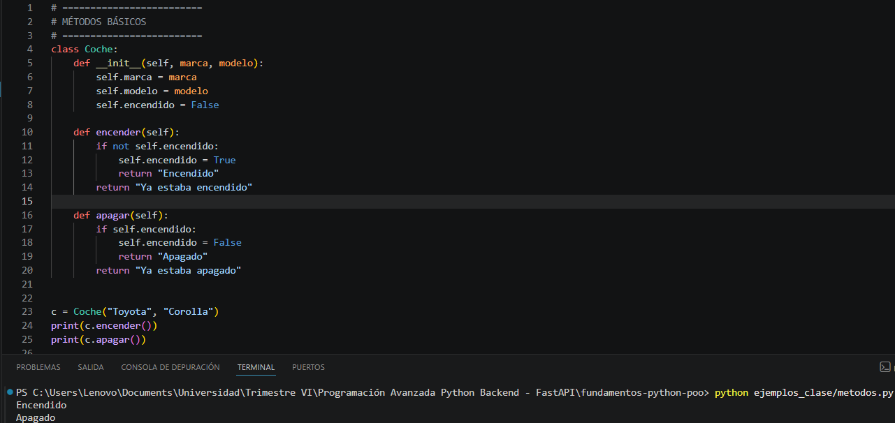

# Métodos con Parámetros

Mostrar:

- Acelerar
- Frenar

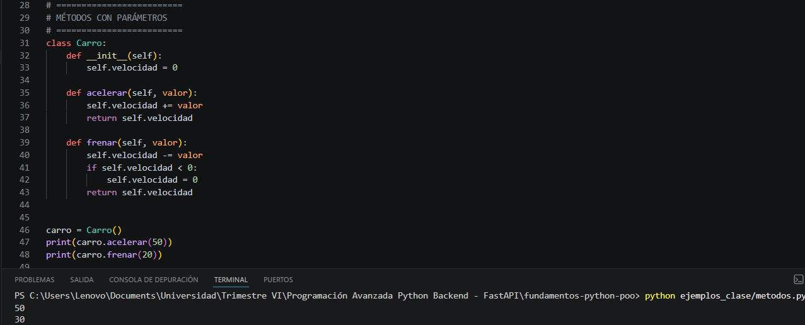

# Métodos que Modifican Atributos

Mostrar:

- Depositar dinero
- Retirar dinero

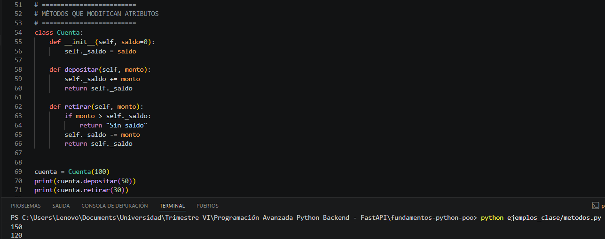

# Métodos que Devuelven Datos

Mostrar:

- Resultado suma
- Resultado división

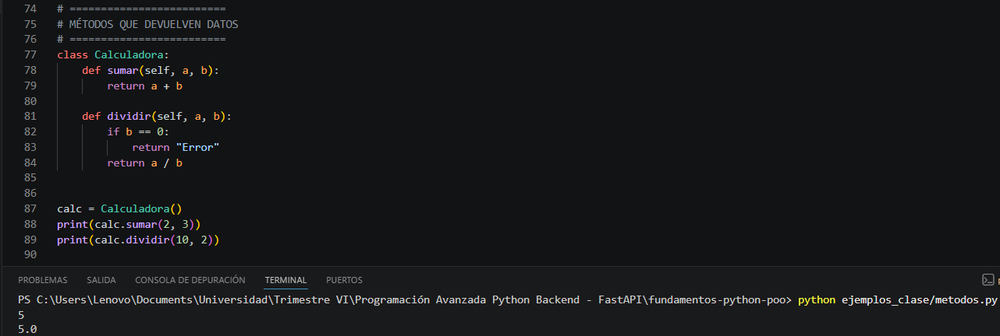

# Métodos que Llaman Otros Métodos

Mostrar:

- Resultado de presentarse()

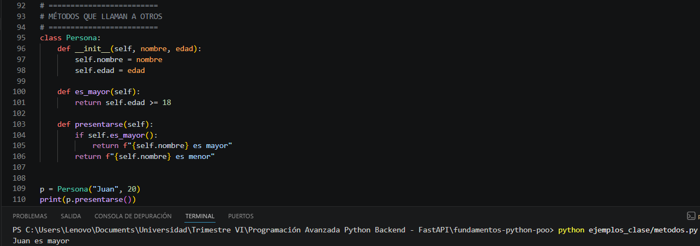

# Métodos Especiales

Mostrar:

- Impresión de objeto
- Suma de objetos
- Comparación de objetos

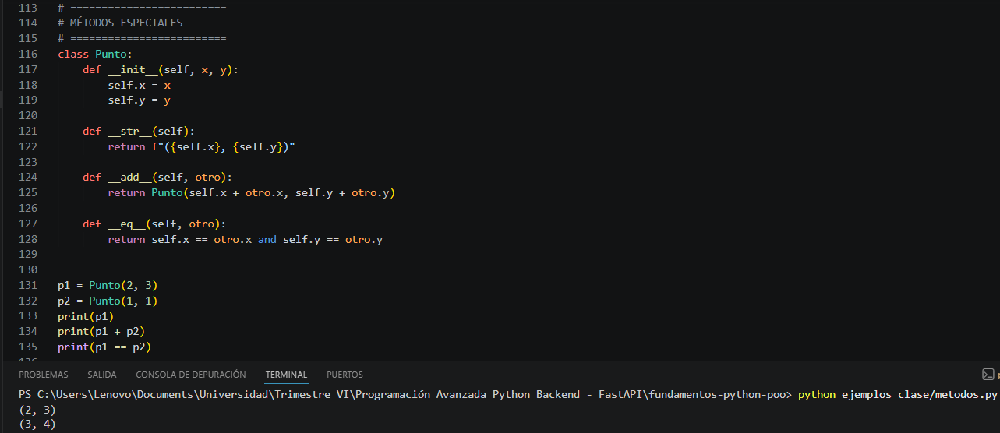

# Métodos Estáticos

Mostrar:

- Resultado de es_par

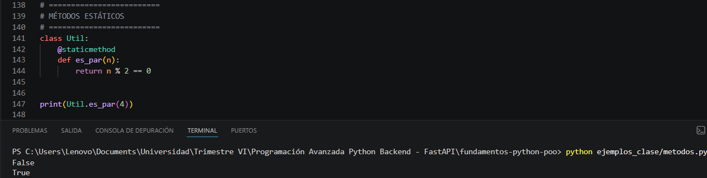

# Métodos de Clase

Mostrar:

- Contador de empleados

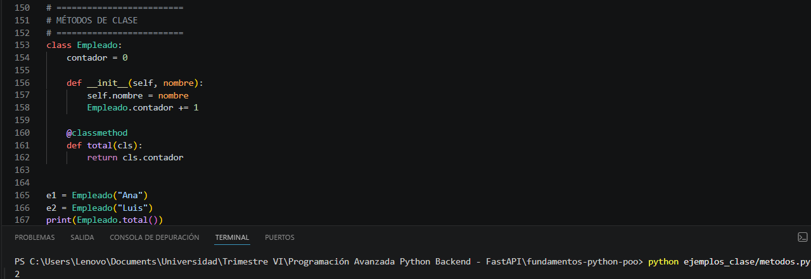

# Ejemplo Completo

Mostrar:

- Abrir libro
- Mostrar estado

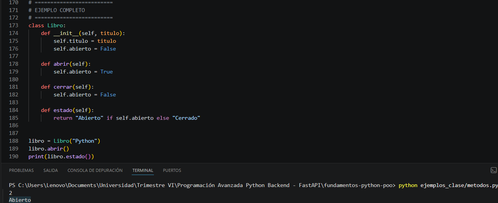

</details>

---

## Encapsulación

<details>
<summary>Ver capturas de encapsulación</summary>

---

# Atributos Privados

Mostrar:

- Creación de `CuentaBancaria`
- Validación correcta del PIN
- Uso de atributos protegidos `_titular` y `_saldo`

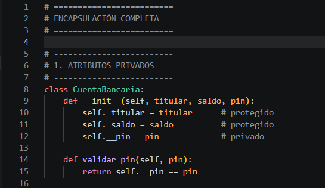

# Getters y Setters

Mostrar:

- Creación de objeto Persona
- Cambio de edad usando set_edad()
- Resultado usando get_edad()

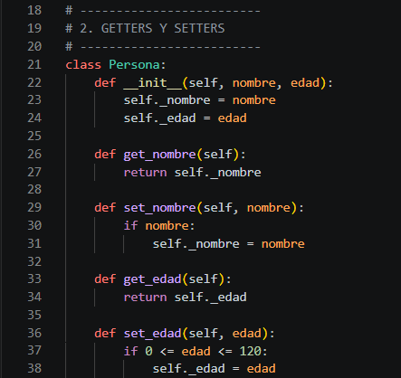

# Propiedades (@property)

Mostrar:

- Conversión de Celsius a Fahrenheit
- Uso de @property
- Resultado correcto en consola

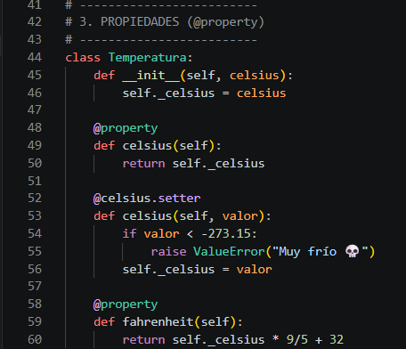

# Métodos Privados

Mostrar:

- Creación del Autenticador
- Login correcto
- Funcionamiento del método privado __generar_hash

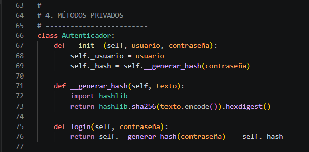

# Ejemplo Completo

Mostrar:

- Aplicación de descuento
- Precio actualizado
- Resultado final mostrado en consola

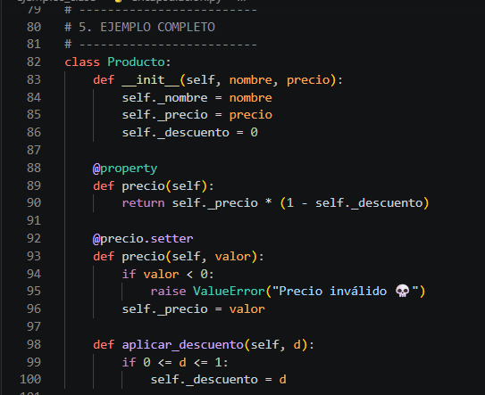

# Ejecución Completa del Programa

Mostrar:

- Validación de PIN
- Edad actualizada
- Temperatura en Fahrenheit
- Login exitoso
- Precio con descuento

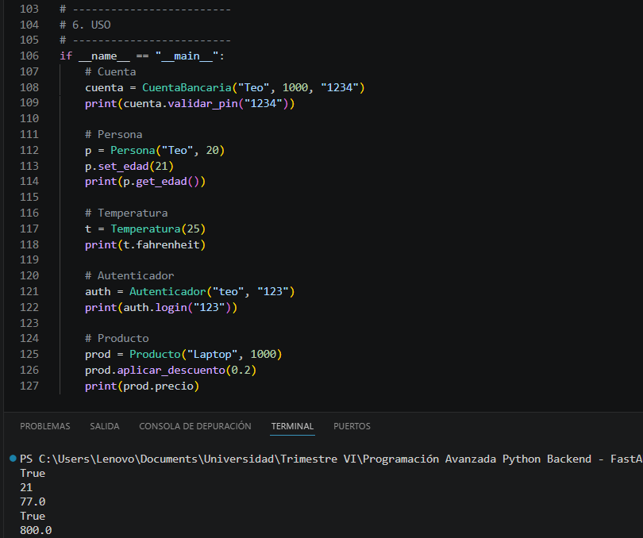

<details>