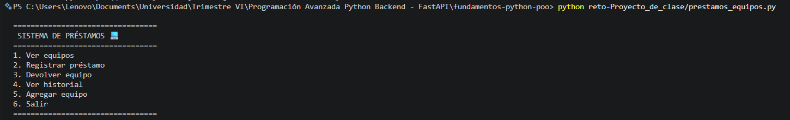
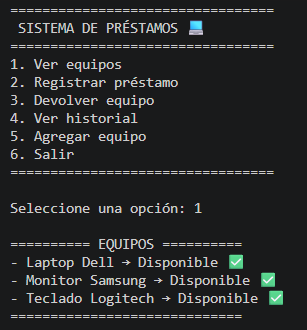
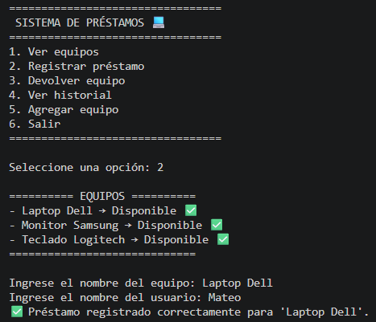
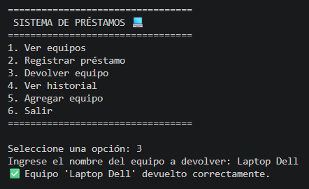
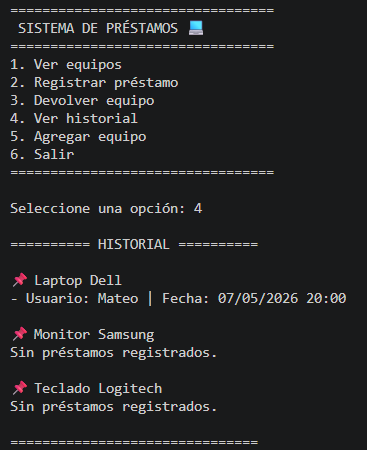
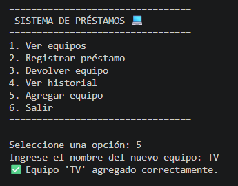
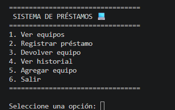

# Sistema de Préstamos de Equipos

Proyecto desarrollado en Python aplicando:

- Programación Orientada a Objetos
- Listas
- Tuplas
- Diccionarios
- Funciones
- Encapsulación básica
- Menú interactivo

El sistema permite gestionar préstamos y devoluciones de equipos de manera sencilla e intuitiva. 🚀

---

# Estructura del Proyecto

```python
reto-Proyecto_de_clase/
│
├── prestamos_equipos.py
└── README.md
```

---

# Ejecución

Desde la terminal ejecutar:

```python
python reto-Proyecto_de_clase/prestamos_equipos.py
```

---

# Funcionalidades

- Ver equipos disponibles  
- Registrar préstamos  
- Devolver equipos  
- Ver historial de préstamos  
- Agregar nuevos equipos  
- Menú interactivo  

---

# Conceptos Aplicados

| Concepto | Uso |
|---|---|
| Listas | Historial de préstamos |
| Tuplas | Registro `(usuario, fecha)` |
| Diccionarios | Inventario de equipos |
| Funciones | Modularización |
| Condicionales | Validaciones |
| Ciclos | Menú interactivo |

---

# Evidencias

<details>
<summary>Ver capturas del funcionamiento</summary>

---

# Menú principal



---

# Ver equipos



---

# Registrar préstamo



---

# Devolver equipo



---

# Ver historial



---

# Agregar equipo



---

# Salida completa



---

</details>

---

# Conclusión

Este proyecto permitió aplicar de manera práctica los conceptos fundamentales de Python, utilizando listas, tuplas y diccionarios para desarrollar un sistema funcional de préstamos de equipos, además, se fortaleció el uso de funciones, validaciones y estructuras de control para crear una aplicación organizada, modular e interactiva.
