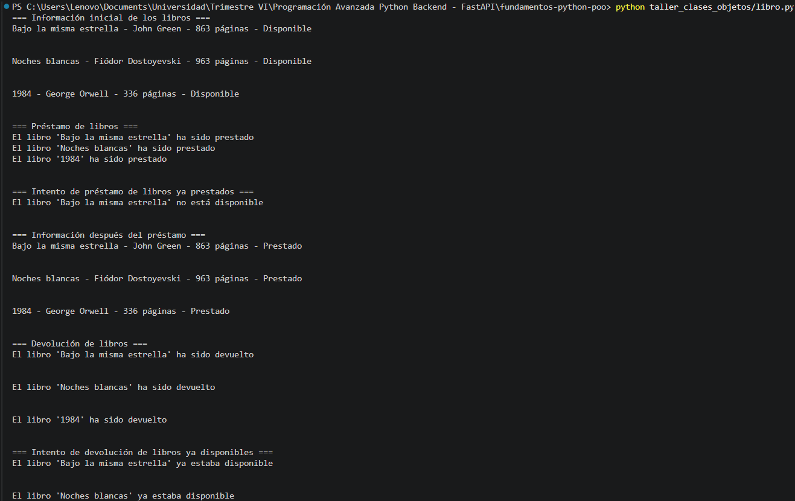
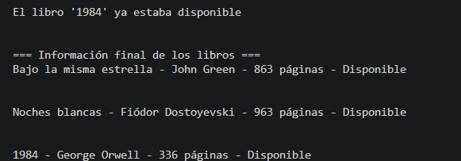

# Taller Clases y Objetos en Python

## Descripción
Este taller consiste en la creación de una clase `Libro` en Python, aplicando conceptos básicos de Programación Orientada a Objetos (POO) como atributos, métodos y encapsulación simple.

---

## Clase Implementada: `Libro`

### 🔹 Atributos
- `titulo`: Nombre del libro
- `autor`: Autor del libro
- `paginas`: Número total de páginas
- `disponible`: Estado del libro (True = disponible, False = prestado)

### 🔹 Métodos
- `__init__`: Constructor que inicializa los atributos
- `prestar()`: Marca el libro como prestado
- `devolver()`: Marca el libro como disponible
- `informacion()`: Retorna los datos del libro

---
## Ejecución
```python
python taller_clases_objetos/libro.py
```

## Conclusión

Este ejercicio permite comprender cómo crear clases, definir atributos y métodos, y manipular objetos en Python de manera sencilla pero funcional.

## Codigo:

```python
class Libro:
    def __init__(self, titulo, autor, paginas):
        self.titulo = titulo
        self.autor = autor
        self.paginas = paginas
        self.disponible = True

    def prestar(self):
        if self.disponible:
            self.disponible = False
            return f"El libro '{self.titulo}' ha sido prestado"
        else:
            return f"El libro '{self.titulo}' no está disponible"

    def devolver(self):
        if not self.disponible:
            self.disponible = True
            return f"El libro '{self.titulo}' ha sido devuelto"
        else:
            return f"El libro '{self.titulo}' ya estaba disponible"

    def informacion(self):
        estado = "Disponible" if self.disponible else "Prestado"
        return f"{self.titulo} - {self.autor} - {self.paginas} páginas - {estado}"


def main():
    libro1 = Libro("Bajo la misma estrella", "John Green", 863)
    libro2 = Libro("Noches blancas", "Fiódor Dostoyevski", 963)
    libro3 = Libro("1984", "George Orwell", 336)
    

    # Mostrar información inicial de los libros
    print("=== Información inicial de los libros ===")
    print(libro1.informacion())
    print("\n")
    print(libro2.informacion())
    print("\n")
    print(libro3.informacion())
    print("\n")

    # Prestar los libros
    print("=== Préstamo de libros ===")
    print(libro1.prestar())
    print(libro2.prestar())
    print(libro3.prestar())
    print("\n")
    
    # Intentar prestar un libro ya prestado
    print("=== Intento de préstamo de libros ya prestados ===")
    print(libro1.prestar())
    print("\n")
    
    # Mostrar información después del préstamo
    print("=== Información después del préstamo ===")
    print(libro1.informacion())
    print("\n")
    print(libro2.informacion())
    print("\n")
    print(libro3.informacion())
    print("\n")

    # Devolver un libro
    print("=== Devolución de libros ===")
    print(libro1.devolver())
    print("\n")
    print(libro2.devolver())
    print("\n")
    print(libro3.devolver())
    print("\n")
    
    # Intentar devolver un libro ya disponible
    print("=== Intento de devolución de libros ya disponibles ===")
    print(libro1.devolver())
    print("\n")
    print(libro2.devolver())
    print("\n")
    print(libro3.devolver())
    print("\n")

    # Mostrar información final
    print("=== Información final de los libros ===")
    print(libro1.informacion())
    print("\n")
    print(libro2.informacion())
    print("\n")
    print(libro3.informacion())

if __name__ == "__main__":
    main()
```

## Salida 




