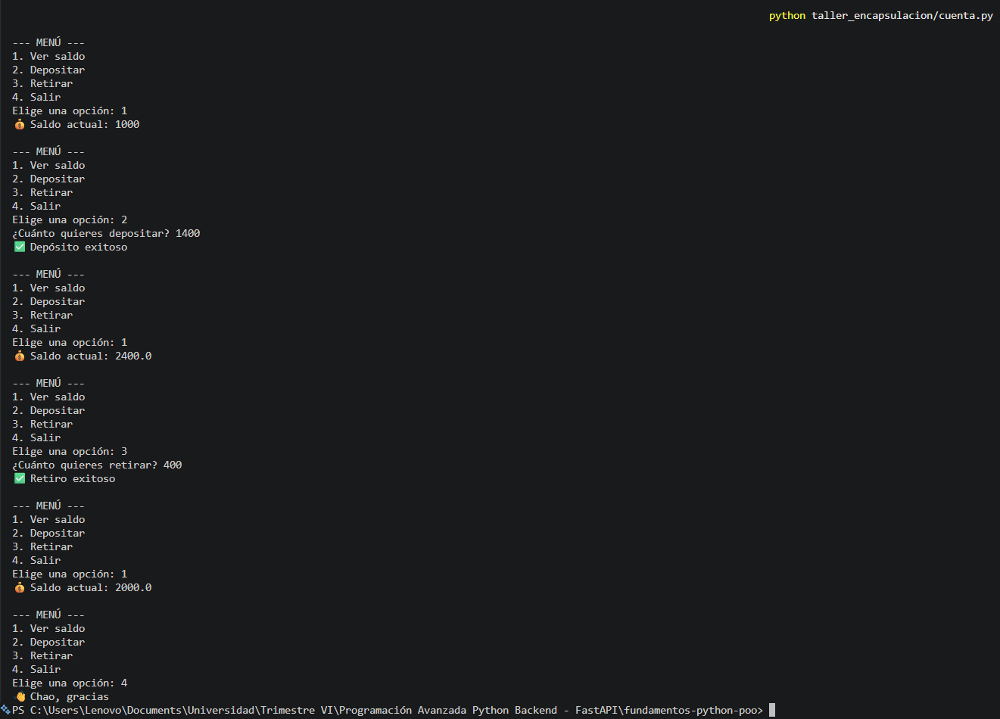

# Taller de Encapsulación en Python

## Descripción
Este taller implementa el concepto de **encapsulación** mediante una clase `CuentaBancaria`, utilizando atributos privados y propiedades (`@property`) para controlar el acceso a los datos.

Además, se incluye un sistema interactivo en consola para depositar y retirar dinero.

---

## Objetivo
Aplicar encapsulación en Python:
- Uso de atributos privados (`_atributo`)
- Uso de propiedades (`@property`)
- Validación de datos
- Métodos para manipular el estado del objeto

---

## Clase: `CuentaBancaria`

### 🔹 Atributos
- `_titular`: Nombre del titular (solo lectura)
- `_saldo`: Saldo de la cuenta (no puede ser negativo)

### 🔹 Propiedades
- `titular`: Solo lectura
- `saldo`: Lectura y escritura con validación

### 🔹 Métodos
- `depositar(cantidad)`: Aumenta el saldo si es válido
- `retirar(cantidad)`: Disminuye el saldo si hay fondos

---

## Ejecución
```python
python taller_encapsulacion/cuenta.py
```

## Conclusión

Este taller permitió aplicar el concepto de encapsulación en Python mediante el uso de atributos privados y propiedades, garantizando un acceso controlado a los datos, se comprendió cómo validar información antes de modificarla y cómo proteger el estado interno de una clase, además, el sistema interactivo ayudó a reforzar el uso práctico de métodos y lógica de control, haciendo el programa más funcional y cercano a un caso real.

## Codigo:

```python
# =========================
# TALLER ENCAPSULACIÓN
# =========================

class CuentaBancaria:
    def __init__(self, titular, saldo=0):
        self._titular = titular
        self._saldo = saldo

    # -------------------------
    # PROPIEDAD SOLO LECTURA
    # -------------------------
    @property
    def titular(self):
        return self._titular

    # -------------------------
    # PROPIEDAD CON VALIDACIÓN
    # -------------------------
    @property
    def saldo(self):
        return self._saldo

    @saldo.setter
    def saldo(self, valor):
        if valor < 0:
            raise ValueError("El saldo no puede ser negativo")
        self._saldo = valor

    # -------------------------
    # MÉTODOS
    # -------------------------
    def depositar(self, cantidad):
        if cantidad > 0:
            self._saldo += cantidad
            return True
        return False

    def retirar(self, cantidad):
        if cantidad > 0 and cantidad <= self._saldo:
            self._saldo -= cantidad
            return True
        return False


# =========================
# PRUEBAS
# =========================
# =========================
# SISTEMA INTERACTIVO
# =========================

cuenta = CuentaBancaria("Teo", 1000)

while True:
    print("\n--- MENÚ ---")
    print("1. Ver saldo")
    print("2. Depositar")
    print("3. Retirar")
    print("4. Salir")

    opcion = input("Elige una opción: ")

    if opcion == "1":
        print(f"💰 Saldo actual: {cuenta.saldo}")

    elif opcion == "2":
        try:
            monto = float(input("¿Cuánto quieres depositar? "))
            if cuenta.depositar(monto):
                print("✅ Depósito exitoso")
            else:
                print("❌ Monto inválido")
        except:
            print("❌ Eso no es un número bro")

    elif opcion == "3":
        try:
            monto = float(input("¿Cuánto quieres retirar? "))
            if cuenta.retirar(monto):
                print("✅ Retiro exitoso")
            else:
                print("❌ Fondos insuficientes o monto inválido")
        except:
            print("❌ Eso no es un número ")

    elif opcion == "4":
        print("👋 Chao, gracias")
        break

    else:
        print("❌ Opción inválida, aprende a leer 😒")
```

## Salida 

